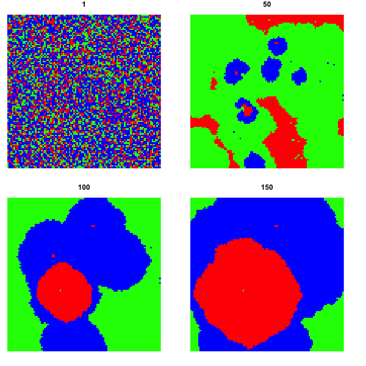
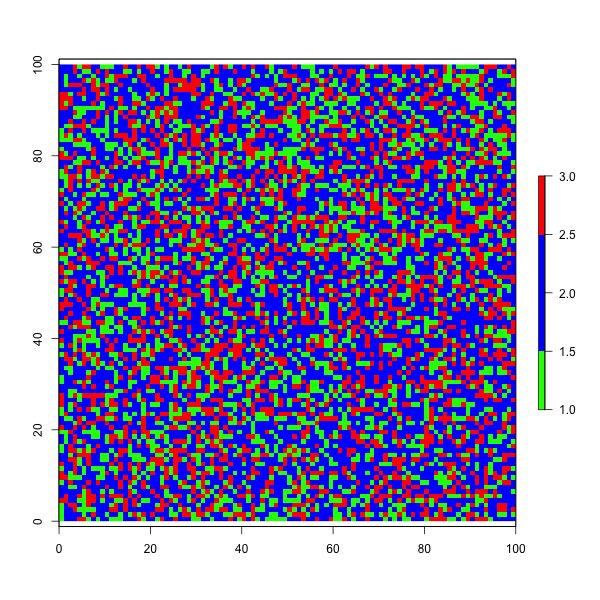

<!-- README.md is generated from README.Rmd. Please edit that file -->
RPSimulator
===========

The goal of RPSimulator is to mimic [Andrew Webb's RPS simulation](https://github.com/grey-area/rps-automata)

Installation
------------

``` r
devtools::install_github('beemyfriend/RPSimulator')
```

Example
-------

This is a basic example which shows you how to solve a common problem:

``` r
#how many colors are we working with?
nclr = 3

#keep note of your seed. Some animations aren't very exciting...
set.seed(1)

sim <- RPSimulator::runRPS(nrow = 100,
                           ncol = 100,
                           nclr = nclr,
                           iterations = 150,
                           threshold = 3)
```

Before we attempt to create an animation. Let's check that the simulation is interesting by sampling different rasters from the raster list. If you do not like the outcome, then change the seed number above.

``` r
#unique color for each clr
cols = hsv(seq(1/nclr, 1, length.out = nclr))

raster::plot(sim[[1]], main = 1, col = cols)
raster::plot(sim[[50]], main = 50, col = cols)
raster::plot(sim[[100]], main = 100, col = cols)
raster::plot(sim[[150]], main = 150, col = cols)
```



Don't forget to reset the graphics parameter by turning off the graphics device.

``` r
dev.off()
```

``` r
RPSimulator::plotRPS(rastList = sim,
                     nclr = nclr,
                     filePath = 'path/to/example.gif')
```


